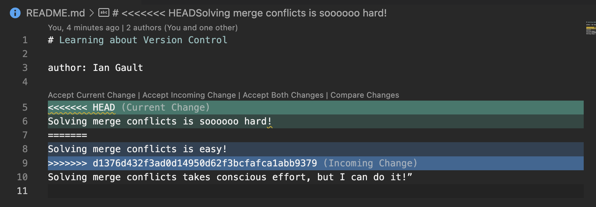
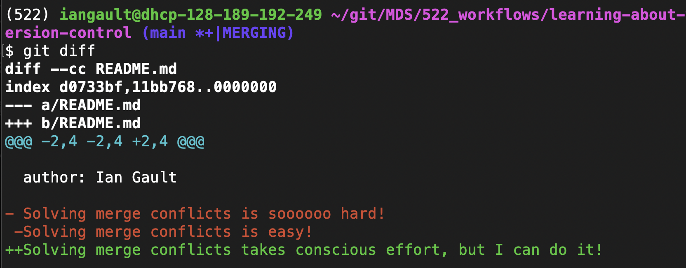

# Learning about Version Control

author: Ian Gault

Solving merge conflicts takes conscious effort, but I can do it!

I like version control because it allows for collaboration and quality control of data science projects

A frustration with version control is not remembering all of the commands and what they do.

https://github.com/iangault/learning-about-version-control/commits/main/

Branching is useful for being able to split from the main branch and work on a separate branch for development, testing, review. It allows for commits to be made on the main branch, while you are able to version control different parts of the project (parallelization of work) and have checkpoints where isolated changes can become part of the shared history.

